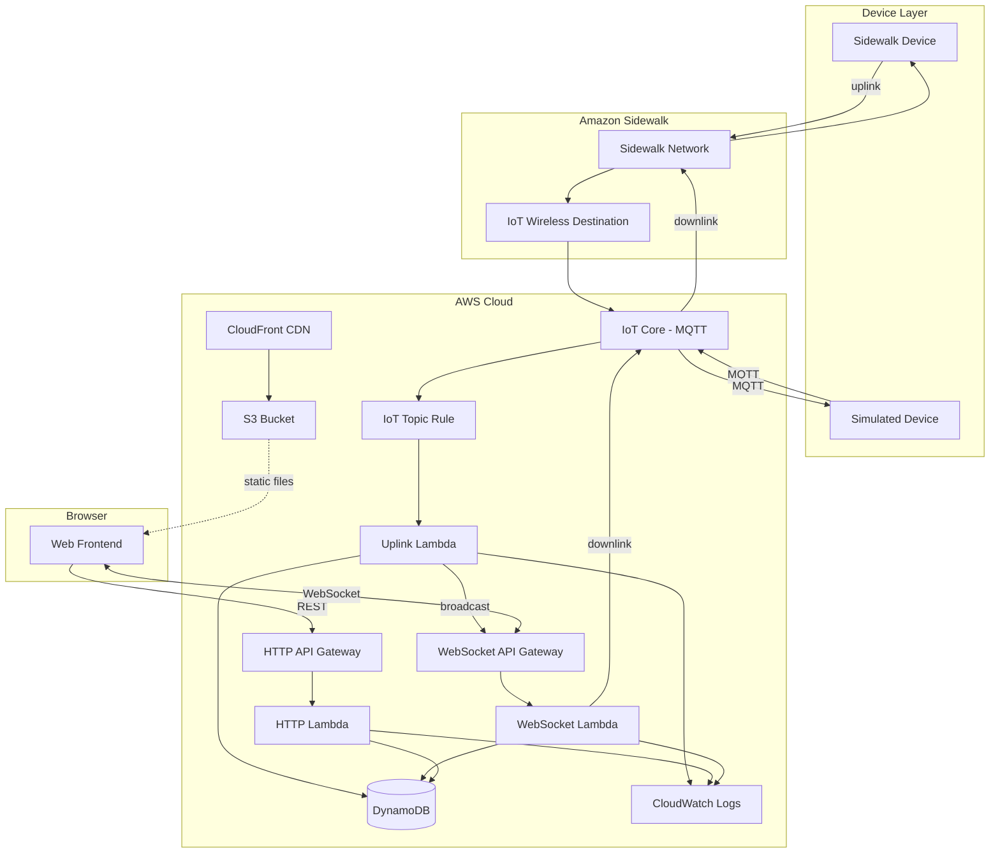

# Architecture Overview

## What This Application Does

This is a sample cloud backend and web frontend that connects Amazon Sidewalk devices to a browser-based dashboard. It is intended for embedded and IoT developers evaluating Sidewalk, demonstrating:

- Receiving sensor data from Sidewalk devices in real time
- Sending commands (actuator state) back to devices
- Displaying device state in a web UI with live updates via WebSocket
- Measuring end-to-end latency (device to cloud to browser and back)

The application is not a production system — it is a reference implementation to help you understand the cloud side of a Sidewalk integration. See [Limitations](limitations.md) for what it intentionally does not cover.

## High-Level Architecture

## AWS Services Used

| Service | Role in this application |
|---------|------------------------|
| **AWS IoT Core** | MQTT message broker for device communication (uplink/downlink topics) |
| **AWS IoT Wireless** | Sidewalk device destination that routes uplink messages to IoT Core |
| **AWS Lambda** | Three functions: uplink message processing, HTTP API handler, WebSocket API handler |
| **Amazon DynamoDB** | Single-table storage for device records and WebSocket connection tracking |
| **Amazon API Gateway v2** | HTTP API (device list/detail) and WebSocket API (real-time updates and commands) |
| **Amazon S3** | Static hosting for the built frontend files |
| **Amazon CloudFront** | CDN in front of S3 for the web frontend |
| **Amazon CloudWatch Logs** | Log groups for the three Lambda functions (7-day retention) |
| **AWS IAM** | Execution roles and policies for Lambda functions and the IoT Wireless destination |
