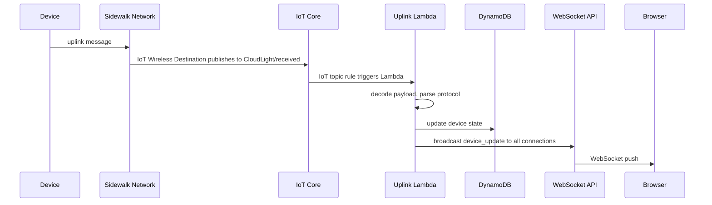
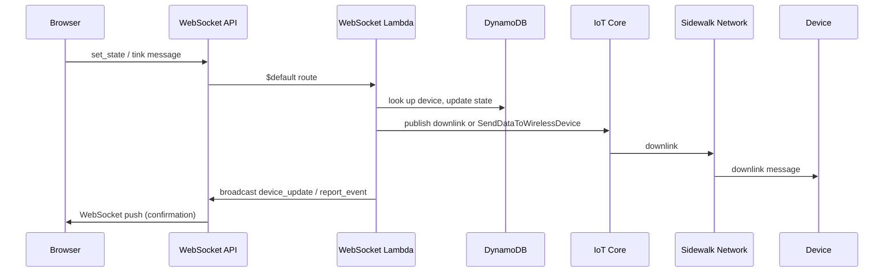
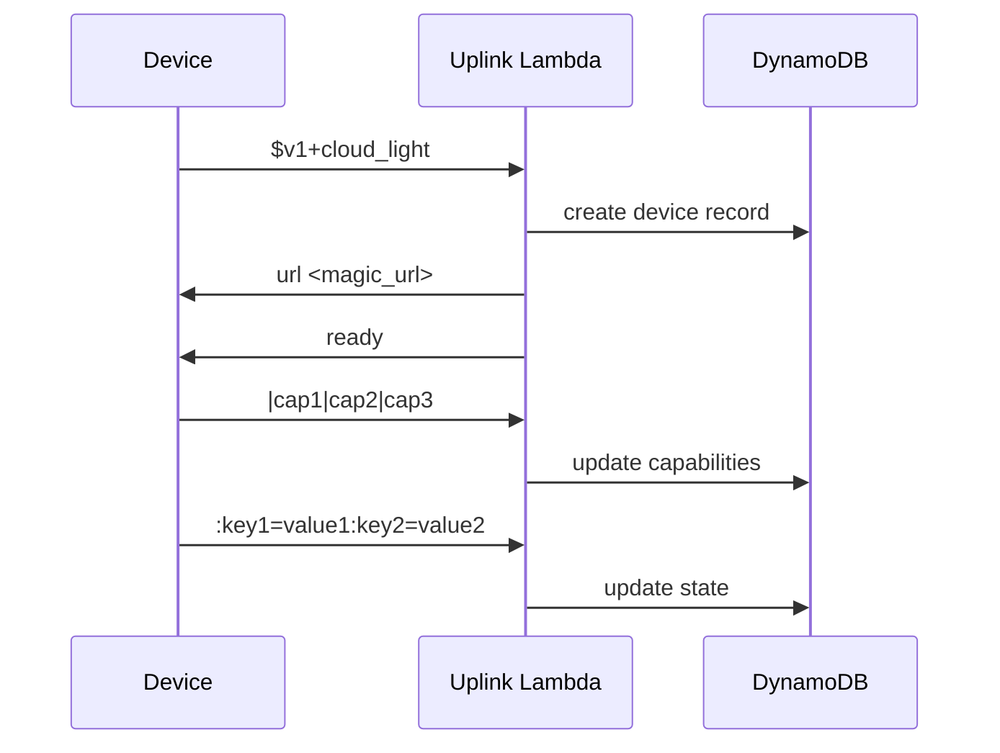

# Data Flow

This document describes how data moves through the system — from device to browser and back.

## Uplink: Device to Cloud to Browser

When a device sends sensor data, the message flows through these stages:

**Step by step:**

1. The Sidewalk device sends an uplink message
2. The Sidewalk network delivers it to **AWS IoT Wireless**, which has a destination (`CloudLightDestination`) configured to publish to the MQTT topic `CloudLight/received`
3. An **IoT topic rule** (`CloudLightUplink`) matches this topic and invokes the **Uplink Lambda**
4. The Lambda decodes the payload (base64 → hex → ASCII for Sidewalk devices), then parses the [device protocol](device-protocol.md) message
5. Based on the message type (pairing, capabilities, state, ping, tonk), the Lambda updates **DynamoDB** and/or sends a downlink response
6. For state updates, the Lambda broadcasts a `device_update` message to all connected WebSocket clients via the **API Gateway Management API**
7. The browser receives the update and renders the new state

## Downlink: Browser to Cloud to Device

When a user changes an actuator value or initiates a latency measurement:

**Step by step:**

1. The user interacts with a control in the web UI (e.g. toggling an LED)
2. The frontend sends a `set_state` JSON message over the WebSocket connection
3. The **WebSocket Lambda** receives the message on the `$default` route
4. The Lambda validates the request and looks up the device in DynamoDB
5. It builds a protocol message (e.g. `:led0=1`) and sends it to the device:
  - **Sidewalk devices**: `SendDataToWirelessDevice` API call with the message base64-encoded and a sequence number
  - **Simulated devices**: MQTT publish to `CloudLight/simulated/{deviceId}/downlink`
6. The Lambda updates the device state in DynamoDB and broadcasts confirmation to all WebSocket clients

## REST: Device List and Detail

The HTTP API provides read-only access to device data. This is used to get the current state when the frontend is loaded in a browser.

**Endpoints:**

| Method | Path            | Description         |
| ------ | --------------- | ------------------- |
| `GET`  | `/devices`      | List all devices    |
| `GET`  | `/devices/{id}` | Get a single device |

All requests require `Authorization: Bearer <password>` header. CORS is enabled for browser access.

## Device Pairing Flow

When a device connects for the first time, it goes through a pairing sequence:

1. **Pairing request**: The device sends `$v1+cloud_light` (optionally with its SMSN). This identifies the application and protocol version
2. **Device record created**: The Lambda creates a new device entry in DynamoDB
3. **Magic URL**: The Lambda responds with a URL containing the frontend address, device ID, and authentication token. If the device has a display, it can render this as a QR code for quick access
4. **Ready signal**: The Lambda sends `ready`, telling the device that setup is complete
5. **Capabilities**: The device advertises its sensors and actuators
6. **State updates**: The device begins sending periodic state messages

See [Device Protocol](device-protocol.md) for detailed device protocol and data explanation.

## Simulated Device Path

The [device simulator](device-simulator.md) uses a separate MQTT topic path but the same Uplink Lambda:

| Aspect            | Sidewalk Device                             | Simulated Device                                           |
| ----------------- | ------------------------------------------- | ---------------------------------------------------------- |
| Uplink topic      | `CloudLight/received`                       | `CloudLight/simulated/{clientId}/received`                 |
| Downlink          | `SendDataToWirelessDevice` API              | MQTT publish to `CloudLight/simulated/{clientId}/downlink` |
| Payload encoding  | Base64 → hex → ASCII                        | Plain text JSON `{"data": "..."}`                          |
| IoT rule          | `CloudLightUplink`                          | `CloudLightUplinkSimulated`                                |
| Sequence tracking | Yes (`seq` field, incremented per downlink) | No                                                         |

Both paths converge in the same Uplink Lambda handler, which detects the device type from the event structure and uses the appropriate transport for downlink messages.